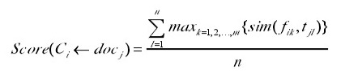
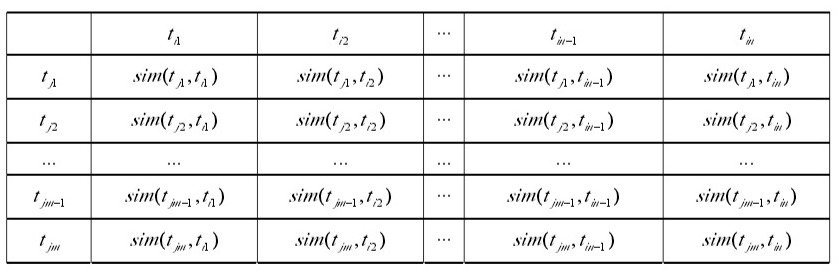
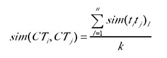

# WeiBoDataMining

[we are here](https://github.com/DataMiningBasedOnWeiBo/WeiBoDataMining.git)

## 关于聚类算法

传统聚类算法多是采用Bag of words方法，容易引起短文本发生特征高维问题，因此需要挖掘词语间共现关系以及顺序关系，获取代表性较强的特征，进而降低特征维度。因此我们打算采用基于频繁项集的聚类算法。同时，在中文中，一个句子的意思除了考虑特征词，还应充分考虑句子的语义。而语义的研究主要是从语法意义角度去归纳，也就是词汇的各种组合。因此，我们小组采用基于频繁项集和语义的聚类算法

层次聚类分为三个步骤：

###一、频繁项集创建初始情感簇，每个初始情感簇文本都含有频繁项集

该步骤在[apriori.py](emotion/apriori.py)中，根据原来微博文本的频繁项集创建初始的情感簇

####输入：微博数据，最小簇支持度 min_s 

####输出：微博数据中的频繁项集

####方法： 

1.扫描文本集 D，利用词频统计候选项集出现的次数，收集满足最小支持度 min_s 设定的项集，记为频繁项集； 

2.利用产生的频繁 k 项集构造强关联规则，利用频繁 k 项集构造候选(k+1)
项集，反复迭代直至候选(k+1)项集为空。

###一、根据《知网》的中文语义相似度模型，根据最大语义隶属原则分离各个初始情感簇

该步骤在[overlap.py](emotion/overlap.py)中，使每个文档隶属于一个情感簇中

定义一个文档对于一个情感对隶属得分：

其中sim来自《知网》的中文语义相似度模型

对于一个与多个情感簇关联的文档，计算其对于每个情感簇的隶属得分，取其最大，删去其与剩余情感簇的关联

###三.通过定义簇间语义相似度矩阵，完成微博情感簇的层次聚类，并优化得到最终情感簇

该步骤在[merge.py](emotion/merge.py)中，合并相似情感簇，得到最终聚类结果

定义两个情感簇的相似矩阵：

其中sim依然使来自知网的模型

计算两个情感簇的相似度，取其前k大个

然后利用简单的双重for循环计算任意两个情感簇的相似度，若最大的大于阈值，则合并之，否则return

最后，一个很关键的sim函数，也就是知网的语义相似模型，知网给的字典太尼玛大了，xb童鞋还在疯狂调试中，一调试就死机，我也很绝望啊
